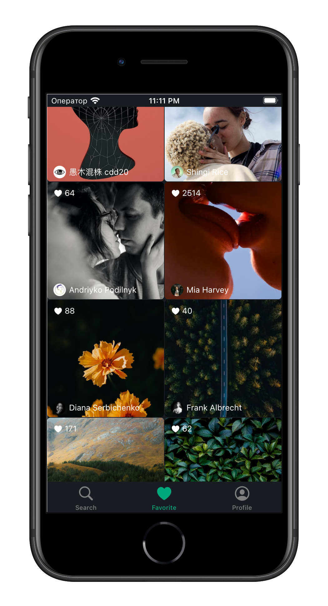
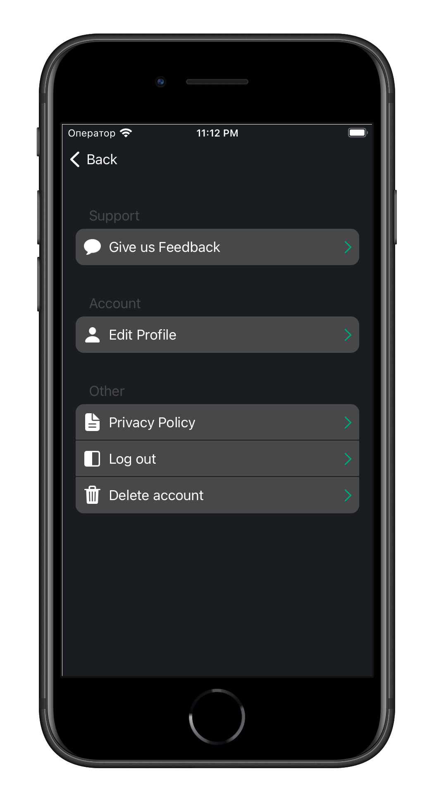
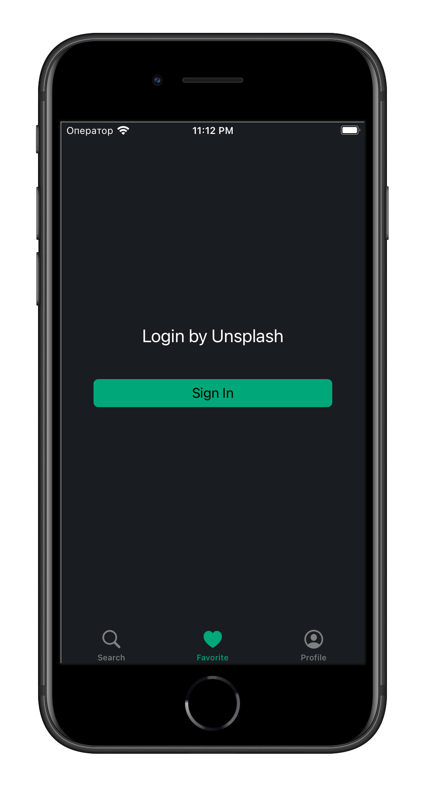
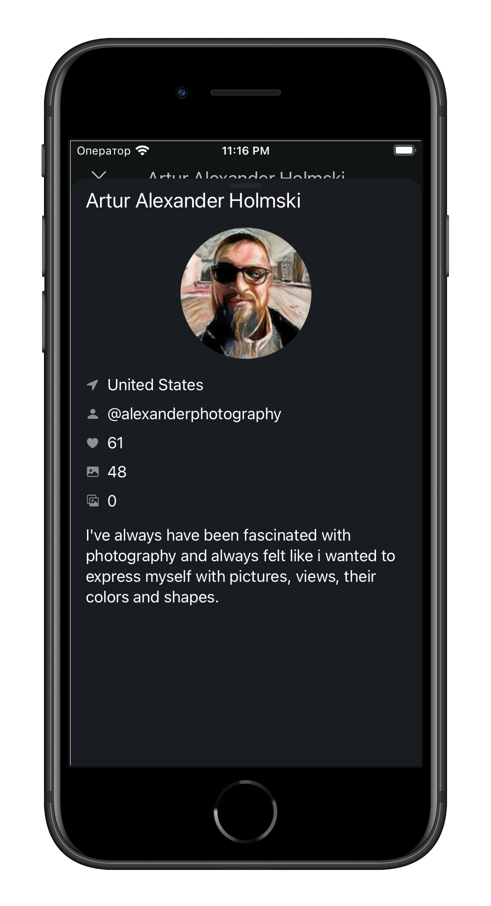
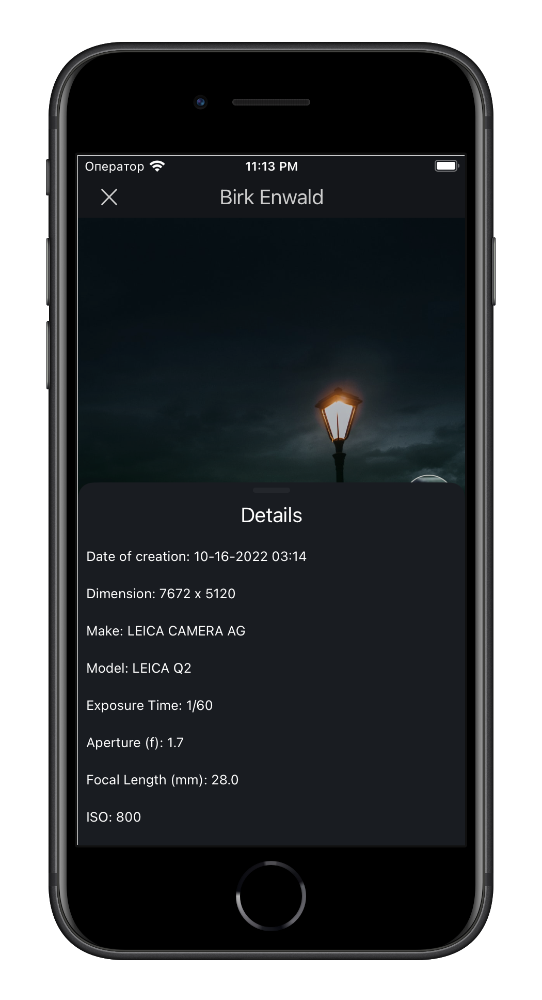
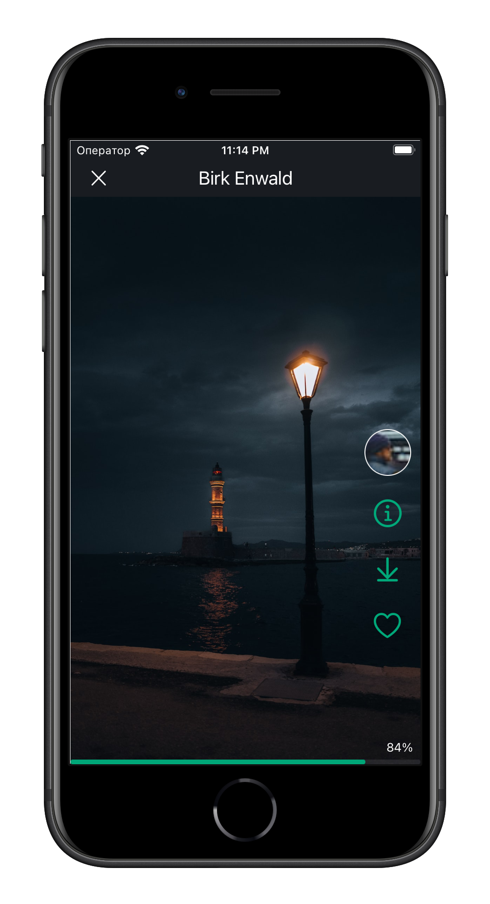
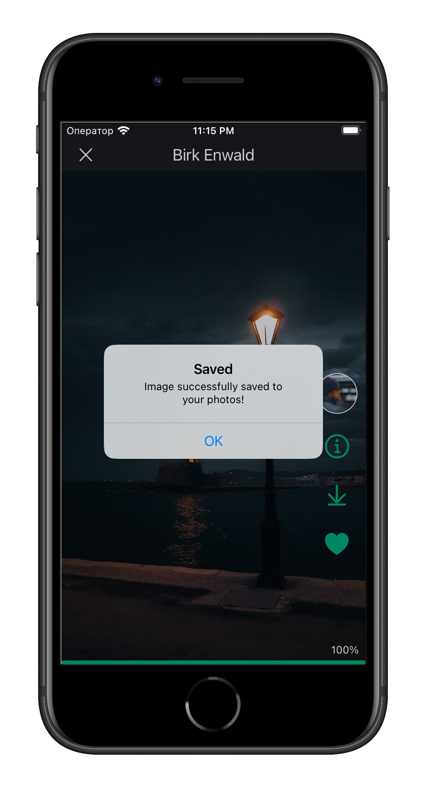
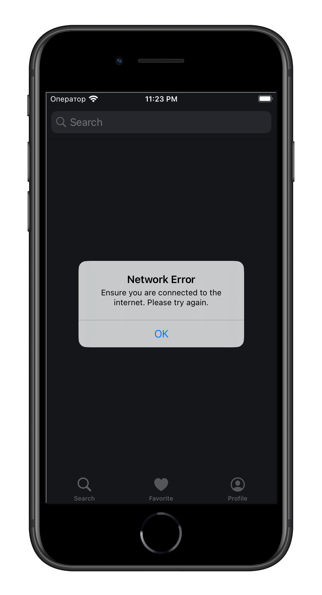

# Salva-Foto
A simple photo saver on the user's phone.

Libraries used:
- Kingfisher
- SwiftyKeychainKit

The application is written without the use of storyboards.

---

 The application has the ability to view random photos, as well as search for photos

 <tr>
    <td></td>
</tr>

---

On a separate screen, the user can view their favorite photos on which the user has put a like.

<tr>
<td></td>
</tr>
---

The user can view his profile and also make changes to his profile

<tr>
    <td></td>
    <td></td>
</tr>

---
If the user is not logged in, he can only view random photos and use the search.

<tr>
    <td></td>
</tr>
---
For each individual photo, the user can display information about the photographer and the parameters of the photo

<tr>
    <td></td>
    <td></td>

</tr>

---
The user can upload a photo he likes to the gallery of his phone

<tr>
    <td></td>
    <td></td>
</tr>

---

If there is no Internet, the user receives a corresponding notification:

<tr>
    <td></td>
</tr>

